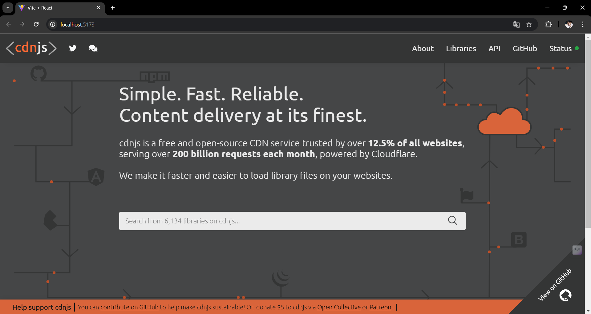
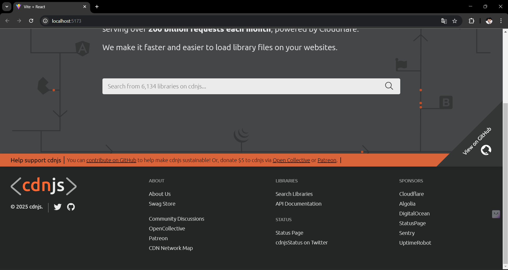

# CDNJS Clone

A fully functional clone of the cdnjs homepage built with React. This project replicates the features and layout of the cdnjs site, providing a hands-on demonstration of using React for web development.

## Table of Contents

- [Installation](#installation)
- [Usage](#usage)
- [Features](#features)
- [Screenshots](#screenshots)
  
## Installation

To set up the project locally, follow these steps:

1. Clone the repository to your local machine:
   ```bash
   git clone https://github.com/yourusername/cdnjs-clone.git
   
2. Change to the project directory:
   ```bash
   cd cdnjs-clone

3. Install the necessary dependencies using npm or yarn:
   ```bash
   npm install
   # or
   yarn install

## Usage
To run the application in development mode, execute the following command:
  ```bash
  npm run dev
  # or
  yarn run dev
```
Open your browser and go to http://localhost:3000 to view the cdnjs homepage clone.

## Features
- Complete clone of the cdnjs homepage
- Responsive design using React
- Integration of various libraries and frameworks
- Demonstrates best practices in React development

## Screenshots



